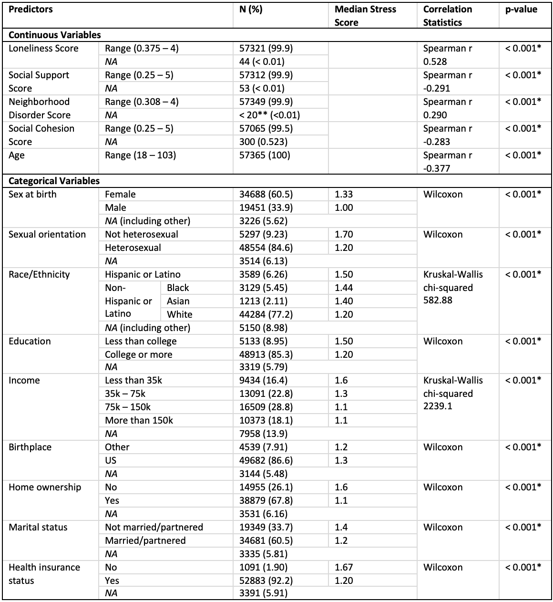
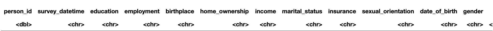
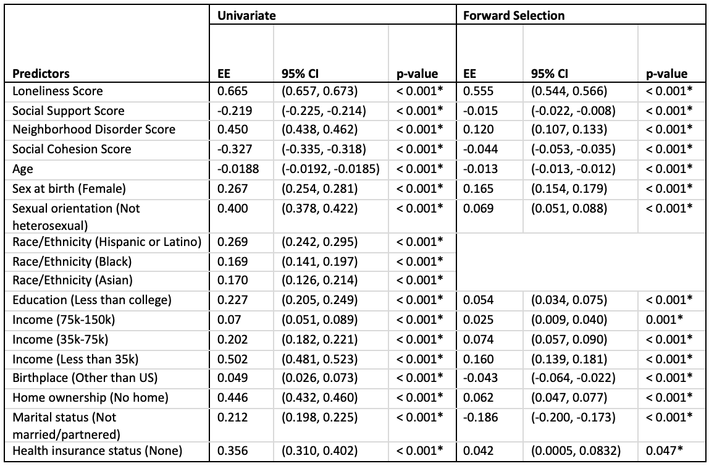

# Methods

We fitted linear regression models to investigate the relationship between the participant’s self-reported loneliness score and stress score. The primary exposure loneliness score has range 0-4, and higher score means greater loneliness. The primary outcome stress score has range 0-4, and higher score means greater stress. NA values take up less than 10% of each variable except for income which has 13.9% NA values. We carried out nonparametric tests for univariate correlation analyses, as our outcome stress score is not normally distributed. Stress score has median of 1.2, mean of 1.313, is right-skewed with skewness of 0.49, and has a kurtosis of 2.8. All predictors were significantly associated with stress score at p-value of 0.05. We checked the linearity assumption for continuous predictors loneliness score, social support score, neighborhood disorder score, social cohesion score, and age by looking at the scatter plot of each vs. stress score. For subsequent linear regression modeling, we excluded NA values which yielded a total of 45,114 complete cases.

Although the outcome stress score is not normally distributed, our sample size is large enough for the central limit theorem to hold. Because we have many predictors, a total of 18, we first carried out univariate regression analyses to exclude any variable that is not significant at p-value 0.05 and decrease the problem of over-fitting. With the significant variables, we used automated forward selection algorithm to select variables for their significance at p-value 0.05 level. To account for the fact that the automated method would include only the significant confounders, we additionally checked the automatically removed variables and included them back in if they changed the loneliness score effect size by more than 10%.


```{r echo=FALSE, out.width = '100%'}

```

Table 1. Stress score univariate correlation test results  
**Any aggregates below 20 is suppressed following All of Us Research Privacy Policy  


# Results


```{r echo=FALSE, out.width = '100%'}
knitr::include_graphics("before.png")
```
```{r echo=FALSE, out.width = '100%'}

```
Figure 1. Before and after data wrangling  
** Individual level data is suppressed following All of Us Research Privacy Policy  

Extensive data wrangling was necessary to make a final tidy dataframe. In the beginning there were three different datasets, including the Demographics (age, sex, etc.), the Basics (income, education, birthplace, etc.), and the Social Determinants (loneliness score, stress score, etc.). Each respondent had multiple rows for each question they answered. I pivoted wide the dataframe so that each column is a question and the value is the answer to the question. I collapsed rows so that each respondent had one row. I selected the questions I wanted and then renamed the columns. I joined the three different datasets together by the respondent IDs. In order to carry out a regression analysis, I changed character values into 0 and 1 for binary variables or 0-3+ factors for multi-categorical variables.

```{r echo=FALSE, out.width = '100%'}

```
Table 2. Stress score linear regression modeling results  

Regression results showed that having a 1 score higher in the loneliness score was associated with a 0.555 higher score in the stress score, with all other predictors held constant. The effect estimate was significant at p-value level of 0.05. To note, in our regression model, the race predictor was excluded by forward selection as it was not significantly associated with the stress score after adjusting for the other predictors. Our exposure of interest, loneliness score, turned out to have the biggest effect in association with the stress score, bigger in magnitude than any other scores. Not being married or partnered was associated with a 0.186 lower score in the stress score compared to those who are married or partnered, with all other predictors held constant, which was the biggest effect size for a predictor that is associated with lower levels of stress.